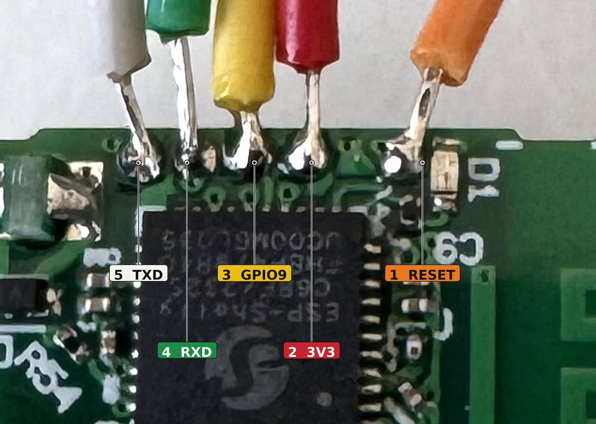
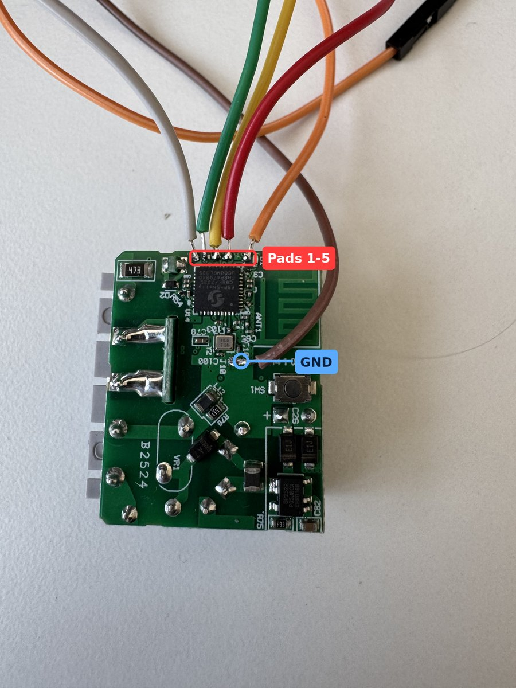

# Flashing the Shelly 1 Mini Gen4 over UART

`FLASHING.md` documents the 7-pin programming header of the full-size Shelly 1 Gen4 and notes that
the Mini exposes different programming pads. This page documents those pads.

The pad assignment below was determined by probing and verified on two units. It is **not
vendor-confirmed** — measure before applying power.

| | |
|---|---|
| Board revision | `Gen4 1 0.1.2` |
| Chip | ESP32-C6 (`ESP-Shelly C6BF`), QFN40, rev v0.2 |
| Flash | 8 MB, embedded |
| Console | 115200 baud on GPIO16 / GPIO17 |

> [!WARNING]
> Never apply mains voltage while a UART adapter is connected. The Shelly's power supply is **not
> galvanically isolated** — mains and an adapter at the same time will destroy the host computer.
> Power the board from 3.3 V only, and make sure the adapter is set to 3.3 V logic levels.

## The pad row

A row of five plated through-holes sits at the board edge next to the radio chip. **The row contains
no ground pad** — ground has to be picked up separately, see below. The layout suggests a factory
test fixture: a bed-of-nails jig powers the board through the L/N terminals and therefore needs
neither 3V3 nor GND in the pad field.

### Orientation

Two landmarks that work regardless of how the board is held:

- Pad 1 sits immediately next to the **`D1`** silkscreen marking.
- Pad 1 has a visibly **wider gap** to pad 2; the remaining four are evenly spaced.

In the photos below the pad row runs along the top edge and the PCB antenna is on the right, which
puts pad 1 on the right.

| Pad | Signal | Chip pin (QFN40) |
|---:|---|---|
| 1 | RESET (CHIP_PU) | 4 |
| 2 | 3.3 V | VDDA3P3 net (pins 2/3) |
| 3 | GPIO9 — boot / download | 15 |
| 4 | U0RXD (GPIO17) | 30 |
| 5 | U0TXD (GPIO16) | 29 |



### Ground

Pick up GND from the elongated test pad on the far side of the chip, near the `J10` and `C100`
markings beside the 40 MHz crystal.

Before soldering, confirm with a continuity tester that the point connects to the negative terminal
of the **secondary** bulk capacitor (330 µF / 16 V).

> [!CAUTION]
> Do not measure against — and never take ground from — the large electrolytic capacitor on the
> **primary** side, next to the rectifier diodes. It is mains-referenced.



## Wiring

| Adapter (3.3 V) | Shelly | Note |
|---|---|---|
| GND | ground pad near the crystal | separate, not in the row |
| 3V3 | pad 2 | see [Brownout on first boot](#brownout-on-first-boot) |
| RXD | pad 5 (TXD) | crossed over |
| TXD | pad 4 (RXD) | crossed over |
| RTS *(optional)* | pad 1 (RESET) | enables esptool auto-reset |
| DTR *(optional)* | pad 3 (GPIO9) | enables automatic download mode |

## Entering download mode

Hold **pad 3 (GPIO9)** to GND → briefly tap **pad 1 (RESET)** to GND and release → release GPIO9.

No power cycle is required. The console then shows:

```
rst:0x1 (POWERON),boot:0x44 (DOWNLOAD(USB/UART0/SDIO_FEI_FEO))
waiting for download
```

> [!NOTE]
> On the ESP32-C6 the serial bootloader is entered with **`GPIO9` LOW** at reset while `GPIO8` stays
> HIGH. `GPIO0` is not a boot strapping pin on this chip.

## Partition offsets

Matches `partitions.csv`. Note the partition table itself lives at **`0x10000`**, not the ESP-IDF
default `0x8000`.

| Partition | Offset | Size |
|---|---|---|
| otadata | `0x11000` | `0x2000` |
| nvs | `0x14000` | `0xc000` |
| app_0 | `0x20000` | `0x300000` |
| fs_0 | `0x320000` | `0xe0000` |
| app_1 | `0x400000` | `0x300000` |
| fs_1 | `0x700000` | `0xe0000` |
| zb_storage | `0x7e8000` | `0x8000` |
| shelly | `0x7f0000` | `0x10000` |

## Flashing

Find the port with `ls /dev/cu.*` on macOS (use the `cu.` variant, not `tty.`) or `ls /dev/ttyUSB*`
on Linux. Close any serial monitor before calling esptool — the port can only be held by one
program. `--after no-reset` keeps the chip in the bootloader between commands.

```bash
PORT=/dev/cu.usbserial-XXXX

# 1 — verify communication
esptool --port $PORT --after no-reset chip-id

# 2 — full-chip backup, 8 MB
esptool --port $PORT --baud 115200 --after no-reset \
  read-flash 0 0x800000 backup.bin

# 3 — erase, preserving zb_storage and shelly
esptool --port $PORT --after no-reset erase-region 0x0 0x7e8000

# 4 — remove the GPIO9 jumper, then write the release contents
esptool --port $PORT --baud 115200 write-flash \
  0x0      bootloader.bin \
  0x10000  partition-table.bin \
  0x11000  otadata.bin \
  0x20000  app.bin \
  0x320000 fs.img
```

Verify the backup is exactly `8388608` bytes before continuing.

`nvs` is deliberately not written — the manifest specifies `"fill": 255`, which is already the case
after erasing.

> [!IMPORTANT]
> Take the backup. The `shelly` partition at `0x7f0000` holds per-device factory data, including the
> device's Matter provisioning. It is unique per unit and cannot be reconstructed. Treat the dump as
> confidential and never paste its contents into an issue.

Stay at **115200** for both reading and writing. With flying-lead wiring, 460800 reliably fails
mid-transfer with `Serial data stream stopped: Possible serial noise or corruption`, and an aborted
write is considerably more annoying than a slow one.

### Brownout on first boot

```
W phy_init: failed to load RF calibration data (0x1102), falling back to full calibration
E BOD: Brownout detector was triggered
```

This is a power problem, not a firmware fault. With `nvs` empty the first boot performs a full RF
calibration, which is the most current-hungry moment in the boot sequence. The 3.3 V output of a
typical FTDI or CP2102 adapter supplies only around 50 mA and collapses under it, and the device
reboots in a loop.

Any of these fixes it: a bench supply rated 500 mA or more, a 470–1000 µF electrolytic across
3V3/GND close to the board, or simply reassembling the device and running it from mains — at which
point the adapter is disconnected anyway.

## After flashing

A successful boot logs:

```
I (438) boot: Loaded app from partition at offset 0x20000
I (463) app_init: Project name:     outlet
I (467) app_init: App version:      1.0.0
I (606) app_main: Outlet relay created with endpoint_id 1
I (606) app_main: Temperature sensor created with endpoint_id 2
```

Then:

1. Hold the button (GPIO22, `SW1` on the board) for **10 seconds** until the LED goes solid, to clear
   leftovers from the previous firmware. Power-cycle afterwards.
2. Enable **Test Net DCL** in the Home Assistant Matter Server, otherwise the device is rejected as
   uncertified.
3. Commission with the setup code from [COMMISSIONING.md](COMMISSIONING.md).

## Recovering a device that will not boot

A device that shows no LED, does not respond to the button and opens no access point is almost
certainly not bricked. The ESP32-C6 ROM bootloader lives in silicon and cannot be erased, so the chip
still answers in download mode.

Wire up as above, enter download mode, and read the console at 115200 — the boot log identifies what
is actually wrong. Then take a backup and reflash with the sequence in [Flashing](#flashing).
